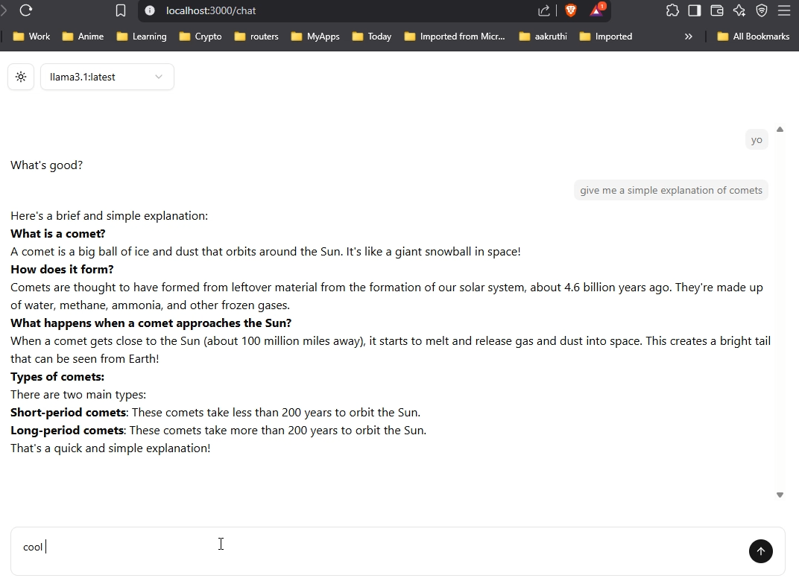

# ConvoBuddy


**ConvoBuddy** is a local AI-powered chatbot built using **Next.js**, leveraging the power of an **Ollama** instance running directly on your device. Designed for smooth, intelligent conversations, ConvoBuddy provides a secure, responsive, and user-friendly chat experience, making it the perfect virtual companion for any occasion.



## Features

- **Default Connection to Ollama**: ConvoBuddy is pre-configured to connect to a local Ollama instance, ensuring fast, reliable, and secure AI interactions without relying on external servers.
  
- **Easy Switching Between Models**: Seamlessly switch between different models with just a few clicks, offering flexibility and customization for a wide range of use cases—from casual conversations to problem-solving.

- **Real-Time AI Responses**: Experience fast, real-time interactions powered by a local Ollama instance, allowing you to have immediate, intelligent conversations whenever you need them.

## Installation

To get started with ConvoBuddy

### 1. **Build the app from source**

#### Prerequisites
Before you start, make sure you have the following installed:

- **Node.js**: [Installation Guide](https://nodejs.org/en/download/)
- **Ollama**: [Installation Guide](https://ollama.com/)

#### Setup Steps

1. **Clone the repository**:
    ```bash
    git clone https://github.com/vishruthp/convobuddy.git
    cd convobuddy
    ```

2. **Install dependencies**:
    ```bash
    npm install
    ```
   
3. **Run the app**:
    ```bash
    npm run dev
    ```

4. Open your app, and you can start chatting with ConvoBuddy!


